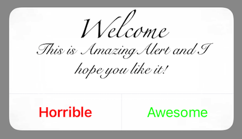
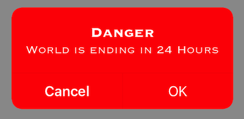
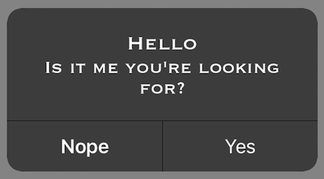

# UIAlertController

An extention to easily customize the UIAlertController.
Does not yet fully support .actionsheet style for the UIAlertController.

WARNING: Changing the UIAlertController is not supported by Apple, Using this extention in you app can get it rejected from the App Store.






## Functions:

- Background Color

  Change the background color by passing a UIColor into the following function. `actionController.addBackgroundColor(color: UIColor)`

- Attributed title

  Change the title font and color by passing the tite string, color and font into the following function. `actionController.setAttributedTitle(title: String, color: UIColor?, font: UIFont?)`

- Attributed Message

  Change the message font and color by passing the message String, color and font into the following function. `actionController.setAttributedMessage(message: String, color: UIColor?, font: UIFont?)`

- Text color Buttons

  There are 2 functions for changing the text color for the buttons:

  - A function to change all the buttons text color:

    `actionController.setAllActionsTextColors(color: UIColor)`

  - A function to change the individual buttons text color:

    `actionController.setActionTextColor(actionTitle: String, color: UIColor)` Here the action title needs to be excatly the same as the title given when intantiating the action.

    ```
    let okAction = UIAlertAction(title: "OK", style: UIAlertActionStyle.default) { (result : UIAlertAction) -> Void in
        print("OK")
    }
    ```

- Tint color

  With this function you can change the overall tintcolor of the alert view by passing in a UIColor into the following function: `actionController.setTintColor(color: UIColor)`

- Visual effects

  This function allows you to change the blurriness and the vibrancy of the alertController. I would recommend playing around with it to achieve the desired effect.

  ```
  let blur = UIBlurEffect(style: .dark)
  let vibrancy = UIVibrancyEffect(blurEffect: blur)  
  alertController.addVisualeffects(blurEffect: blur, vibrancyEffect: vibrancy)
  ```
