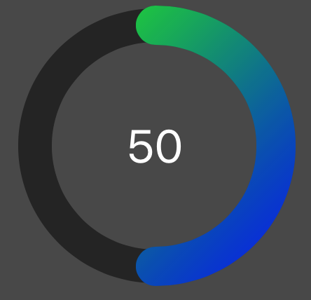
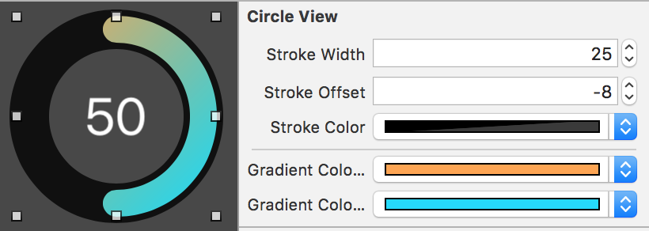
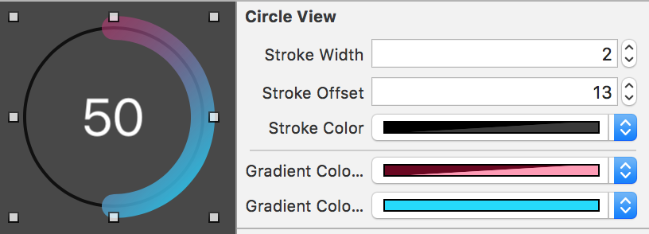
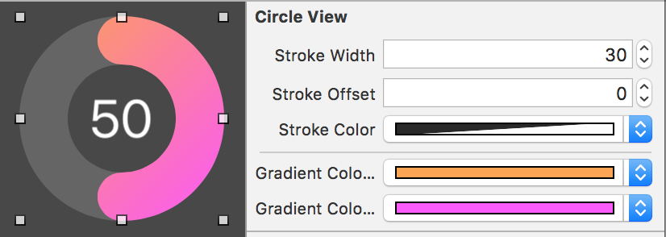
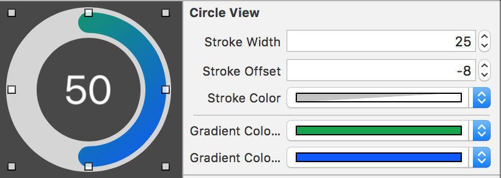

# Circle View Component

The CircleView component draws an interactive circle. Use this like a guage or
meter to show progress, or to set a or input a value. 


Many of the visual properties of the CircleView can be set in storyboard. 

- Line background color
- Foreground line color - this is a gradient
    - Start color, in the upper left
    - End color, in the lower right
- Stroke width
- Stroke offset
- Label size


## Import CircleView

Import the CircleView class into any project by copying
the `CircleView.swift` file into your project. 

## Implement CircleView

Create a CircleView in code with: 

```
let rect = CGRect(x: 20, y: 20, width: 200, height: 200)
let circleView = CircleView(frame: rect)
view.addSubview(circleView)
```

Set the appearance of your CircleView instance by setting these 
properties:

```
circleView.strokeColor = UIColor(white: 0, alpha: 0.5)
circleView.gradientColorA = UIColor.green
circleView.gradientColorB = UIColor.blue
circleView.strokeWidth = 24
circleView.strokeOffset = 4
```

This would create a circle view with 50% transparent black background
stroke, and a value stroke gradient beginning with green in the upper
left to blue in the lower right, a stroke width of 24, and an offset 
of 4.



Stroke offset of a positive value pushes the background stroke **inside**
the colored stroke, while negative numbers allows the background stroke to
encompass the colored stroke. 

Here are a few examples: 






Or create a CircleView with storyboard by drawing a UIView
within a ViewController and setting the **Class** in the 
Identity tab to `CircleView`. 


