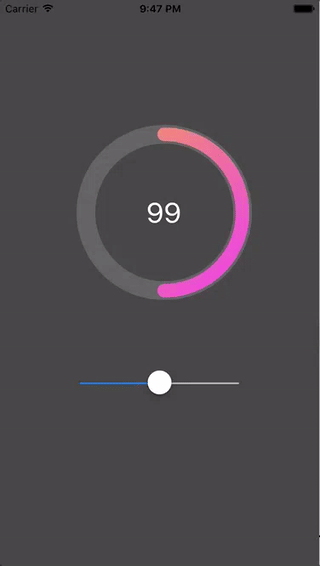
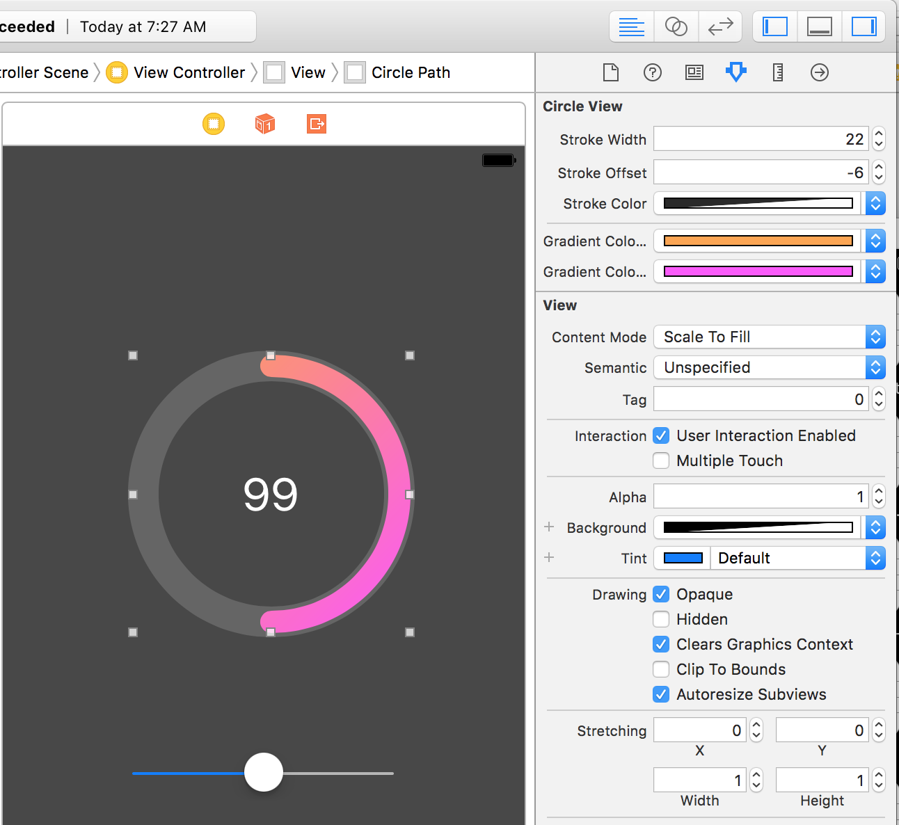

# Circle View Component

The CircleView component draws an interactive circle. Use this like a guage or
meter to show progress, or to set a or input a value. 



Many of the visual properties of the CircleView can be set in storyboard. 

- Line background color
- Foreground line color - this is a gradient
    - Start color, in the upper left
    - End color, in the lower right
- Stroke width
- Stroke offset
- Label size



## Import CircleView

Import the CircleView class into any project by copying
the `CircleView.swift` file into your project. 

## Implement CircleView

Create a CircleView in code with: 

```
let rect = CGRect(x: 20, y: 20, width: 200, height: 200)
let circleView = CircleView(frame: rect)
view.addSubview(circleView)
```

Or create a CircleView with storyboard by drawing a UIView
within a ViewController and setting the **Class** in the 
Identity tab to `CircleView`. 


